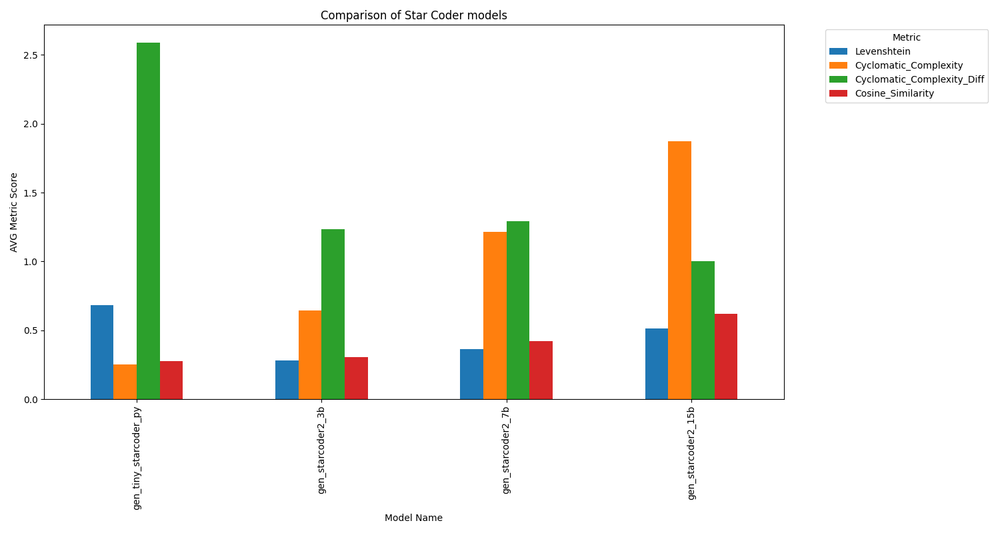

# AI Code Completion

## Approach and Implementation

### 1. Dataset Generation

- **Code File Discovery**: I was focusing mainly on Python (.py), but also added ability to work with C# (.cs) files.
- **Splitting Code Segments**: While decided to simulate the cursor positions, I segmented the code into three parts:
  - **Prefix**: Code preceding the cursor.
  - **Middle**: The code segment that we wanted to be completed.
  - **Suffix**: Code following the cursor.
- **Dataset Compilation**: After processing individual files, I saved them into the .csv file for convenience.

### 2. Interacting with Models

- **Model Selection and Configuration**: The choice is in favor of the Star Coder models. I've chosen model parameters (max_new_tokens, repetition_penalty, top_k, top_p, and temperature etc.) to balance creativity and coherence in the final completions.
- **Prompt Formatting**: After reading some articles and documentation, I used handcrafted function to format prompts with `<fim_prefix>`, `<fim_suffix>`, and `<fim_middle>` tokens. Firstly, it was a bit tricky to get used to the look of model outputs and their formatting.

### 3. Manual Review and Annotation

I understand that automated metrics might not capture the all the aspects of code correctness, so I took a manual review of each generated completion. This involved `Correctness`, `Readability`, `Efficiency`, `Style` and `Overall Quality` of the code.

This step was pivotal in establishing a reliable benchmark for other metrics (even though it was very time-consuming).

### 4. Automated Metrics Evaluation

To quantify the model's performance, I proposed and implemented several automatic metrics:

- **Exact Match**: Just simply checks if the generated code exactly matches the expected code.
- **BLEU Score**: Measures the n-gram overlap between the generated and reference code.
- **ROUGE Score**: Assesses the overlap of n-grams, focusing on recall (nice correlation).
- **Levenshtein Distance**: Calculates the minimum number of single-character edits required to change one word into the other (length alone was not a consistent predictor of quality).
- **Cyclomatic Complexity**: Analyzes the complexity of the generated code.
- **Cosine Similarity**: Evaluates the semantic similarity between the original and generated code embeddings (I noticed high correlation with manual evaluations).

To sum up, metrics like Cosine Similarity, Error Count and ROUGE/BLEU showed better alignment with human judgments, I suppose that might indicate their effectiveness in code evaluation tasks.

## A few notes about findings

- **Model Performance**:
  - **Exact Match Limitation**: Exact Match is a very strange metric, it often penalizes minor yet widely acceptable variations in code structure or variable naming.
  - **BLEU and ROUGE Correlation**: These metrics demonstrated a pretty positive correlation with my manual evaluations.
  - **Cyclomatic Complexity Insights**: Generated code occasionally exhibited higher complexity, it might open potential areas for optimization.
  - **Similarity Score and Error Count** were rather a reliable automatic metrics, exhibiting strong correlations with manual evaluations.
- **Dataset Quality**:
  - **Preprocessing Impact**: I noted that removing comments and strings proved beneficial in focusing the model's attention on the core logic and quality of completions.
- **Automation vs. Manual Review**:
  - Automated metrics provided a very quick, convenient and scalable way to assess model performance but lacked the nuanced understanding that manual reviews offered. On the other hand, LLM-based evaluaiton seems to be seems to be devoid of these flaws.

## Learnings

- **Model Configuration Nuances**:
  - Hyperparameters like temperature, max_tokens and top_p significantly influence the creativity and accuracy of generated code.
  - Quantization seemed to me as a tremendously valuable technique for optimizing large models, making them way more accessible for practical applications.
- **Evaluation Metrics Diversity**:
  - Relying solely on one metric can be kind of misleading, but a combination of metrics provides a better view of model performance.
  - I learned a lot about strengths and limitations of each metric and liked the idea of using embeddings for robust code scoring and analyzing..
  - Structural similarity seemed like very nice score, but it failed dut to the problems that code completions might be partial and libs like ast often fail.
- **Automation Tools and Libraries**:
  - I tried and worked with Transformers and BitsAndBytesConfig libs that was new for me, and evaluation tools such as Levenshtein, sacrebleu, and libs for NLP, Blue and Rouge - all of it really streamlines further the development and evaluation process.
  - I integrated Rich lib for a fancy console outputs that improved the user experience during manual evaluations, It was a bit complex, but after all seemed similar to C# specter console lib.

## Conclusion

So, let's conclude that based on the performed comprehensive evaluation, the `starcoder2-15b` model, with a composite score of 0.4162, outperformed its counterparts across most metrics. It achieved the highest BLEU score (0.2559), ROUGE score (0.3881), and Cosine Similarity (0.6217), while maintaining a relatively low Levenshtein Distance (0.5113) and Cyclomatic Complexity (1.0). **We can say that these results indicate that the larger `starcoder2-15b` model is more adept at generating coherent, semantically accurate, and maintainable code completions.**

_P.S. While we are mostly talking about results from function completion as they intend to be more robust for overall scoring, same reasoning and same results might be deduced from multiline completions as well._

Additionally, `starcoder2-15b` shows us pretty strong results in terms of other evaluation metrics obtained from LLM:

- **Evaluation Score:** With an average eval score of 63.46, it shows a high level of adherence to reference code.
- **Evaluation Difference:** From the evaluation difference we can deduce lower deviation from reference outputs, implying that `starcoder2-15b` better captures the intent and expected structure.
- **Similarity Length Ratio:** A similarity length ratio of 0.73 aligns well with reference output.
- **Error Count:** This model has an average of 1.54, and the median is 1, reinforcing its reliability in producing outputs that are both correct and low in syntactical or structural flaws.

However, the computational demands of `starcoder2-15b` may be a consideration for deployment, if resources are crucial - it's better to consider `starcoder2-7b` for deployment.

### Comparison with Other Models:

| Model               | Composite Score | BLEU    | ROUGE   | Cosine Similarity | Eval Score | Error Count | Notes                                                                                                                                   |
|---------------------|-----------------|---------|---------|-------------------|------------|-------------|-----------------------------------------------------------------------------------------------------------------------------------------|
| `starcoder2-15b`    | **0.4162**      | **0.2559** | **0.3881** | **0.6217**         | 0.85       | 1.0         | Highest performance across metrics; ideal for high-accuracy applications.                                                               |
| `starcoder2-7b`     | 0.37            | 0.1563  | 0.2514  | 0.4214            | 0.75       | 3.0         | Strong performance, slightly lower than `starcoder2-15b`, with really lower computational cost.                                         |
| `starcoder2-3b`     | 0.3473          | 0.0621  | 0.1388  | 0.3031            | 0.5        | 3.0         | Moderate capabilities; suitable for less demanding applications.                                                                        |
| `tiny_starcoder_py` | 0.2583          | 0.0134  | 0.0765  | 0.2781            | 0.1        | 5.0         | Limited effectiveness; best suited for some kind of lightweight tasks where minimal resource usage is prioritized over qualited output. |

While `starcoder2-15b` seems to excel across almost all metrics, `starcoder2-7b` presents a nice alternative where it balances performance with computational resources. However `starcoder2-3b` and `tiny_starcoder_py` offer progressively lighter solutions, that might be suitable for much more simpler tasks or constrained environments.